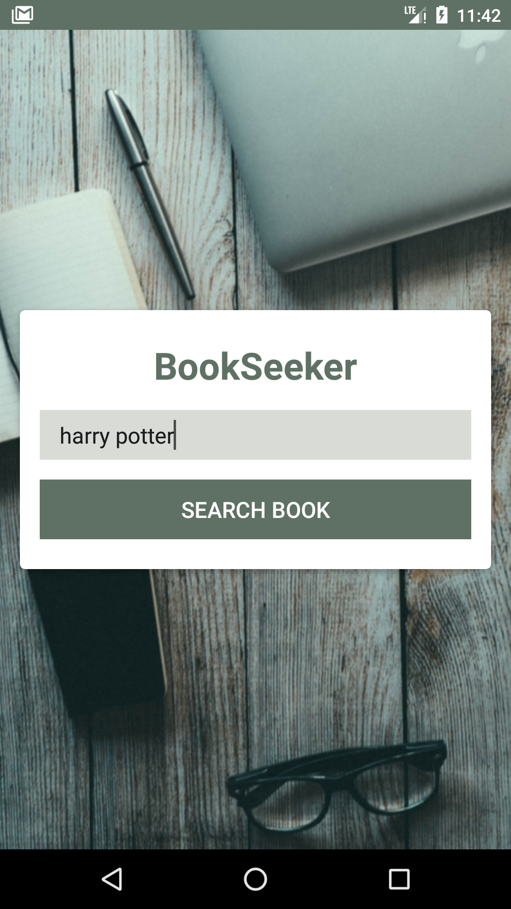
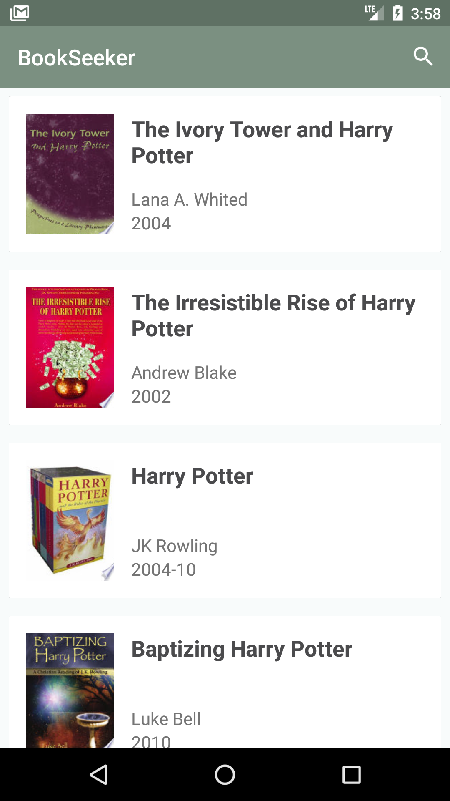
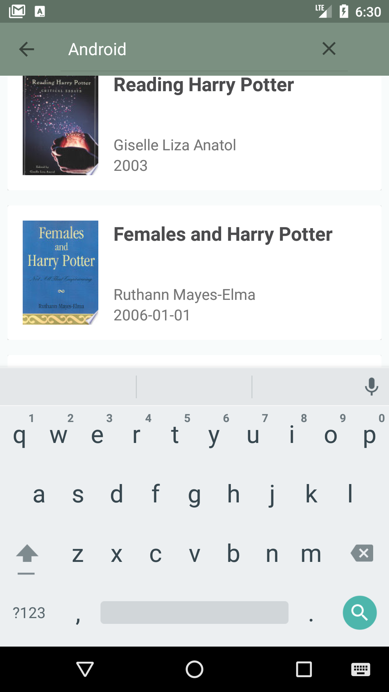
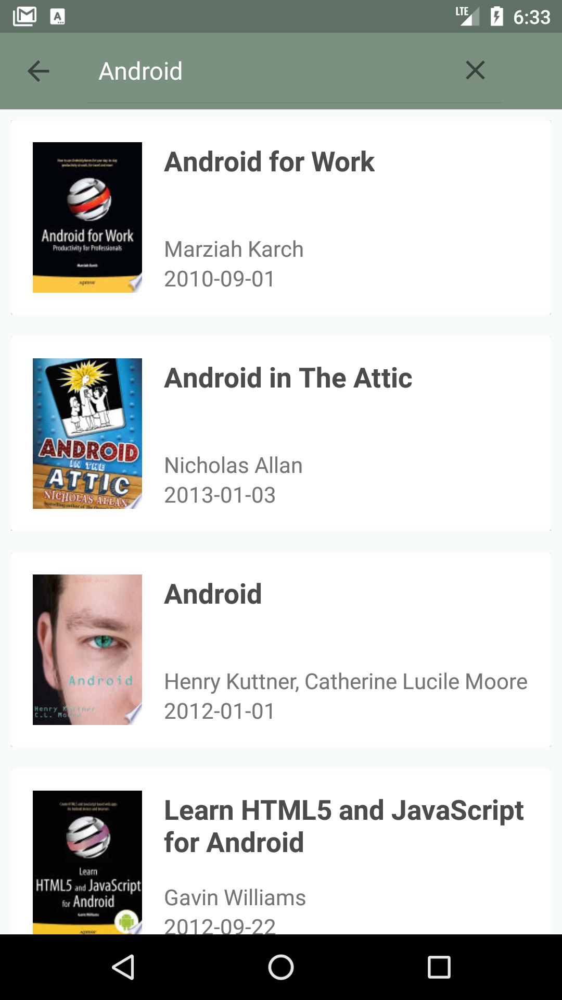
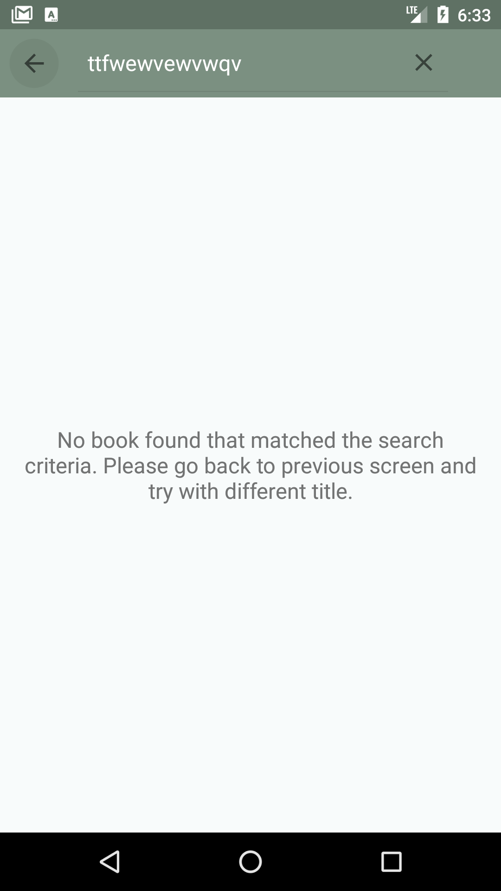
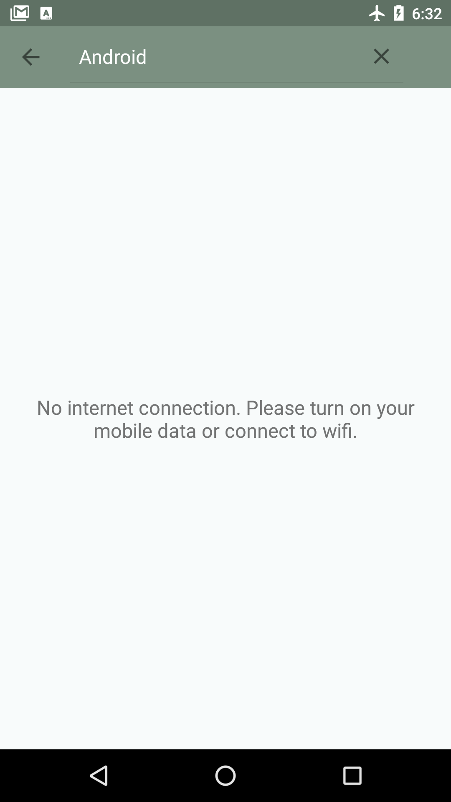
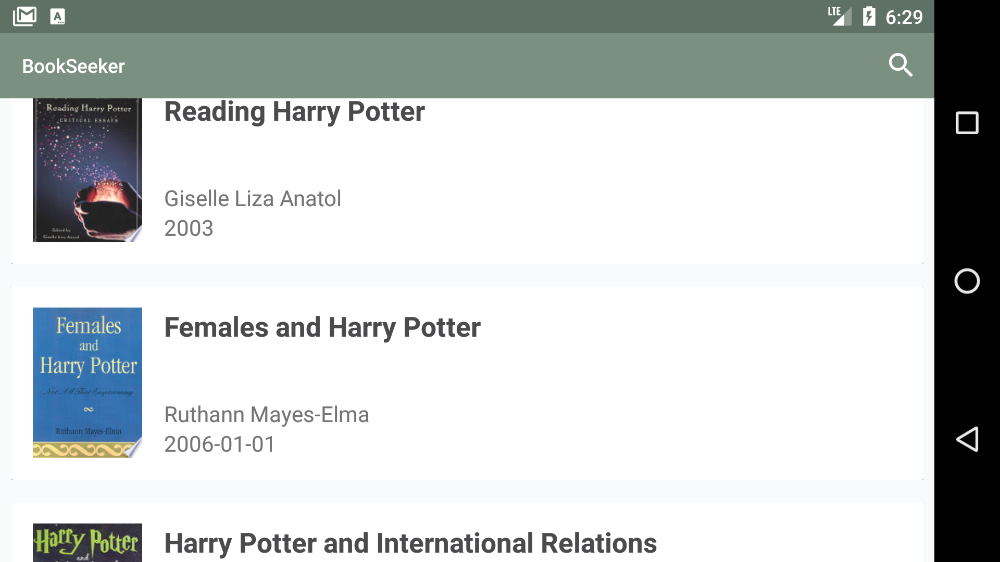
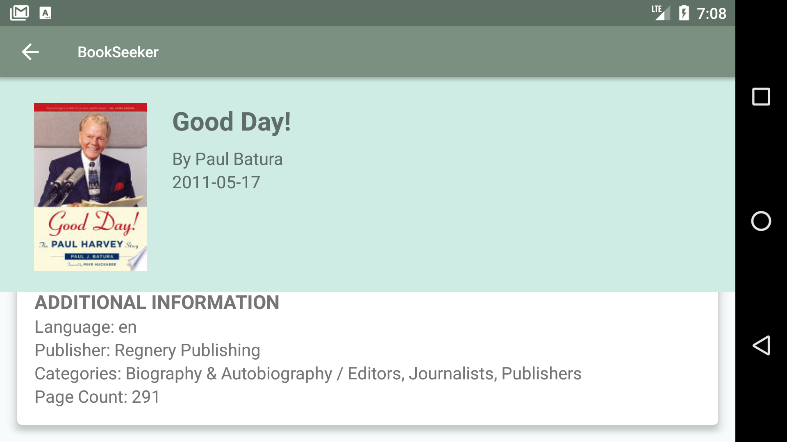

# BookSeeker App

Book listing app written for Udacity Android Basics by Google Nanodegree Program

## Project Background

The goal is to design and create the structure of a Book Listing app which
would allow a user to get a list of published books on a given topic. Google
books api is used to fetch results and display them to the user. This Project
combines various ideas and skills including:

- Fetching data from an API
- Using an AsyncTask
- Parsing a JSON response
- Creating a list based on that data and displaying it to the user.

## Screenshots
User can enter a keyword, press the search button, and receive a list of
published books which relate to that keyword. Google Books API is used to
returns information in a JSON format. List Items display at least book thumbnail,
book's title, authors and published year.

User can press search icon to search for another book.

When there is no data to display for the book, the app shows a default TextView that informs the user how to populate the list. If no internet connect, app shows
text to inform user to connect to internet.

Upon device rotation:
- The layout remains scrollable.
- The app should save state and restore the list back to the previously scrolled position.
- The UI should adjust properly so that all contents of each list item is still visible and not truncated.
- The Search button should still remain visible on the screen after the device is rotated.

